## 3. Работа с удаленными репозиториями и GitHub

### Цель работы

Освоить основные навыки работы с облачными и распределенными системами контроля версий, получить навыки работы с инструментальными средствами, обеспечивающими командную работу над разработкой ПО.

### Задания для выполнения

1. Зарегистрироваться на сайте github.com
2. Установить на компьютере программу Git
3. Форкнуть данный репозиторий в свой аккаунт
4. Склонировать созданный удаленный репозиторий в директорию ~/git/test

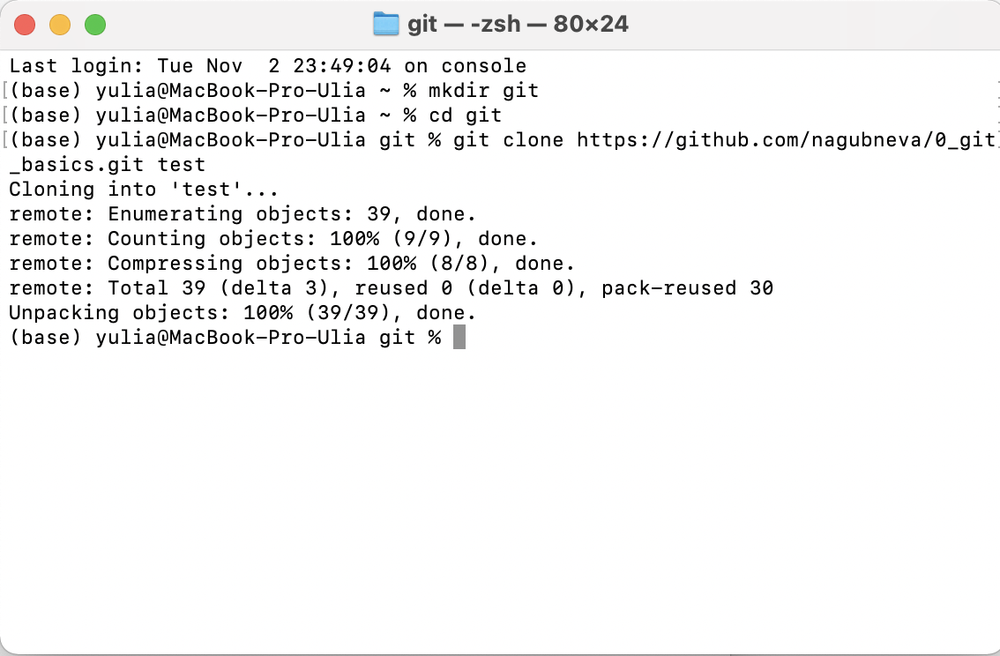

5. На локальной машине пишем скрипт ~/git/test/backup.sh, с произвольным содержанием

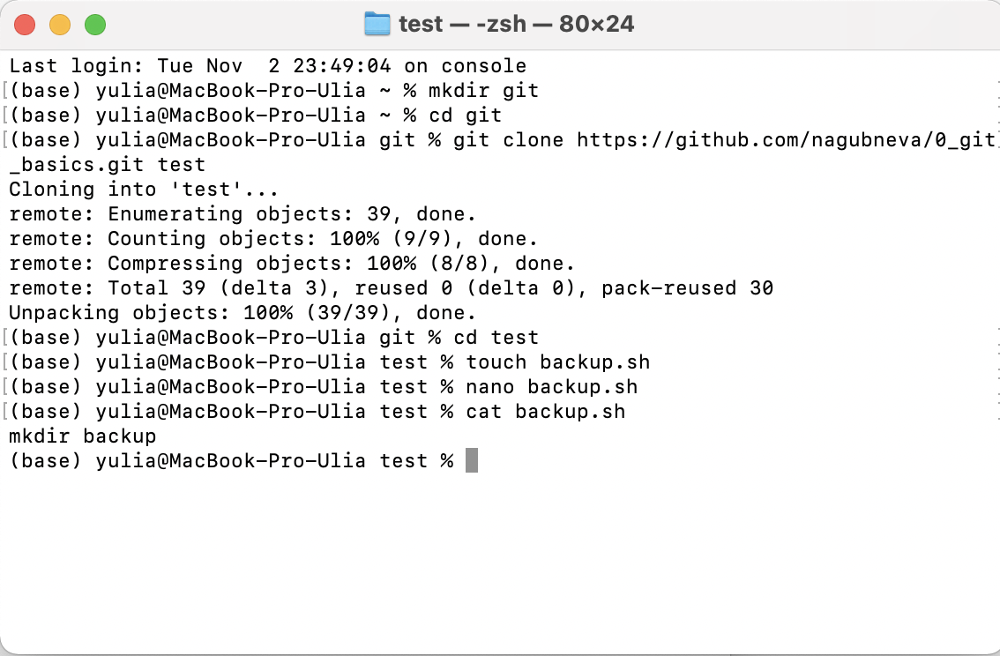

6. Фиксируем скрипт в репозитории (делаем коммит)

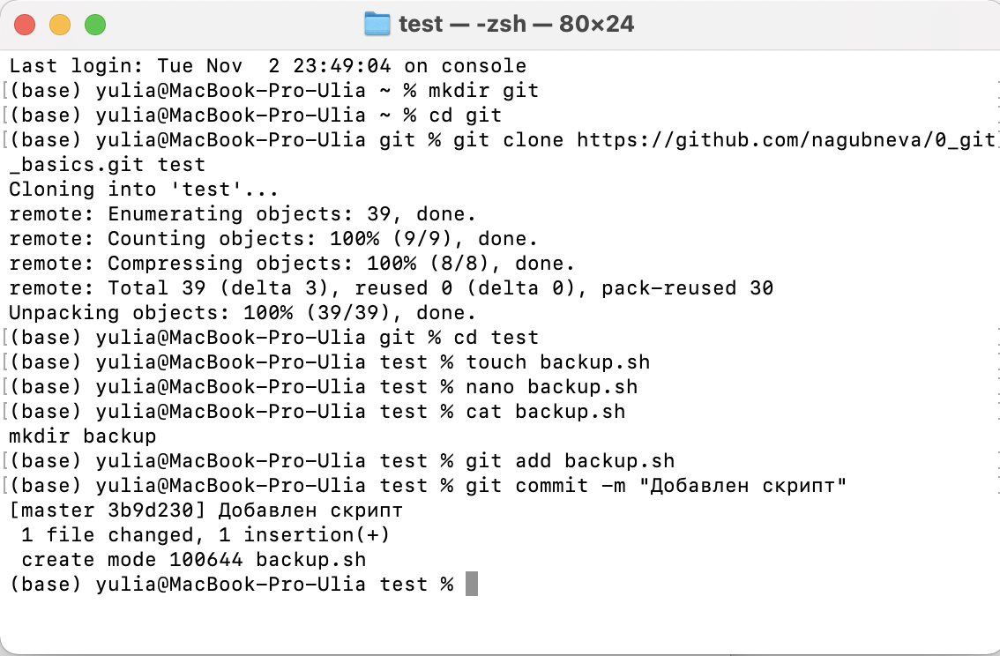

7. Обновляем удаленный репозиторий репозиторий (делаем пуш)

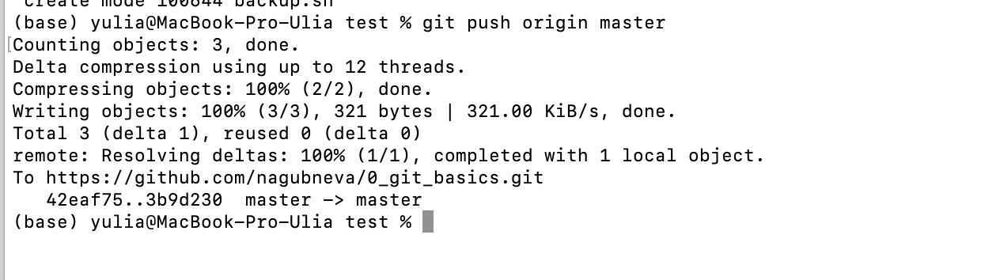

8. Через текстовый редактор добавить любую новую строку с комментарием

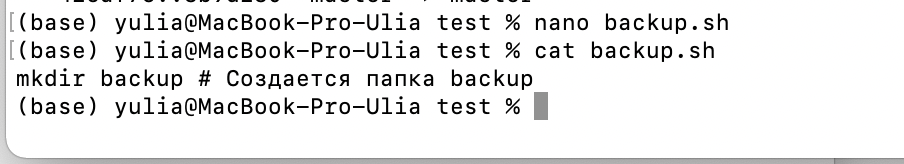

9. Сделать коммит

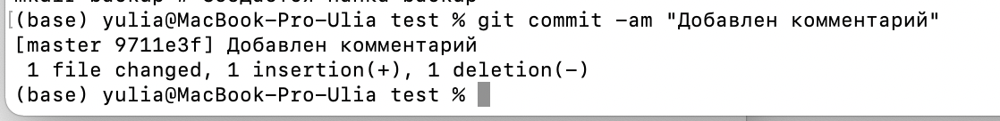

10. Вности синтаксическую ошибку в скрипт

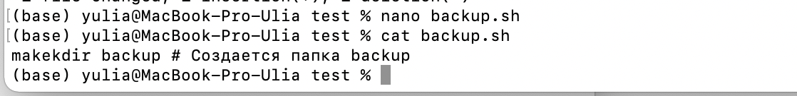

11. Сделать коммит ошибочного скрипта

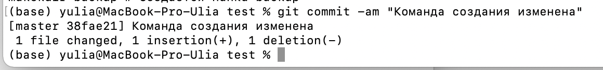

12. Откатываем до последней рабочей версии

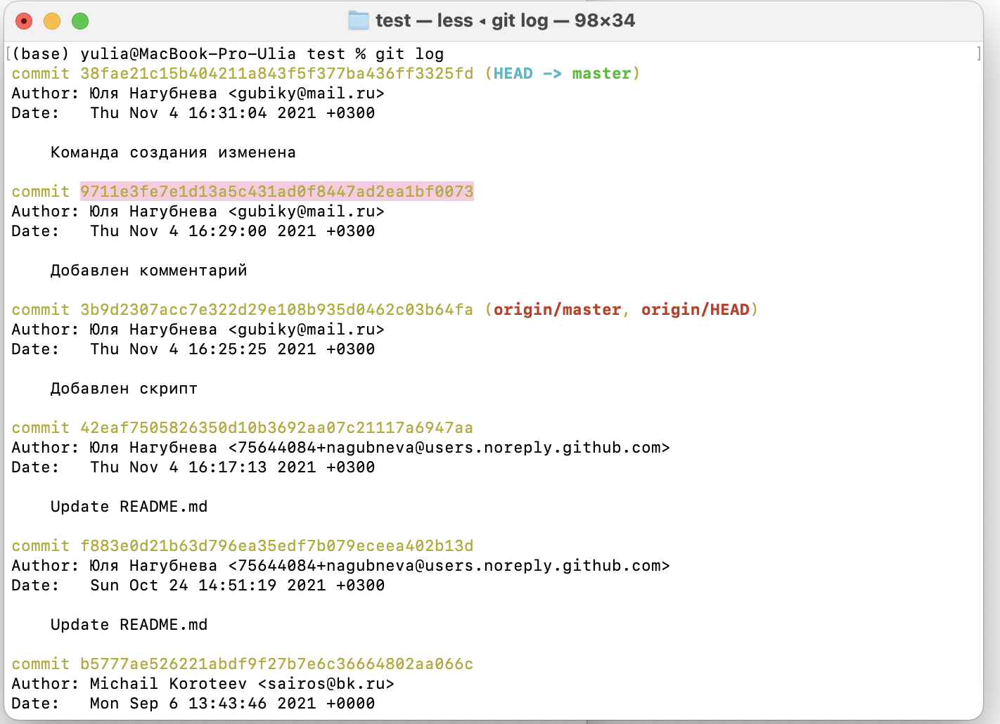
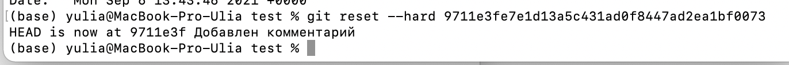

13. Просмотреть историю коммитов

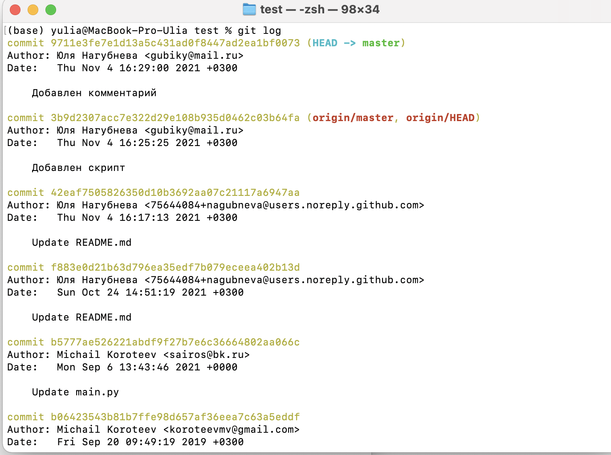
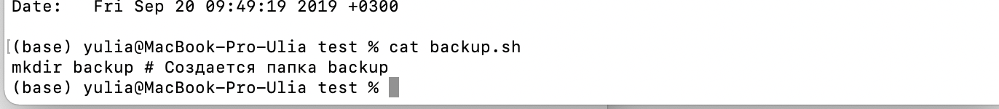

15. Добавить несколько коммитов произвольного содержимого

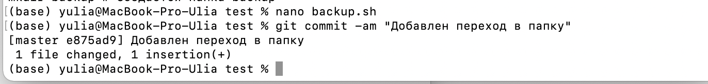
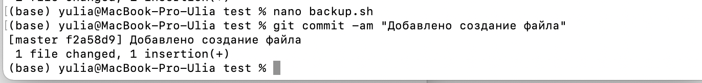

16. Создать пулл реквест в данный репозиторий

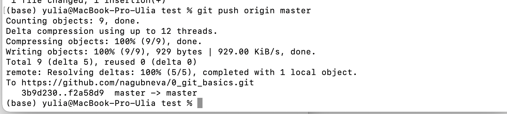

### Контрольные вопросы

1. Зачем нужен облачный хостинг репозиториев?
Чтобы несколько человек могли работать над одним проектом.

2. Какими основными функциями обладает сайт github.com?

Позволяет хранить проекты удалённо на сервере и работать с ними из любой точки мира. Доступ к файлам есть у всех, у кого есть ссылка. 
Одна из главных функций GitHub — контроль версий. Все изменения в коде можно отследить, поэтому в командной разработке это незаменимая вещь.
Кроме того, это способ собрать портфолио.

3. Как организовать командную работу над открытым проектом?
Все люди могут сделать fork репозитория, внести изменения, а потом сделать pull request  в основной репозиторий. Эти правки могут принять или 
отклонить. Таким образом, любой человек может повлиять на разработку открытого проекта. 

